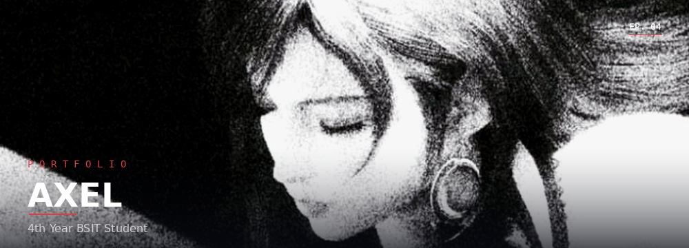

 

 

 

### Hi 👋, I'm Axel

A 4th-year BSIT student and aspiring software engineer who builds clean mobile and web apps. I love how polished and complex modern games are — it pushes me to level up my own skills.

📌 More about me

 

- 🎮 Currently playing: *Genshin Impact*, *Honkai: Star Rail*, *Wuthering Waves*, *Mobile Legends*
- 🎬 Unwinding with anime and random movies for inspiration
- 🛠️ Into mobile & web development, with an eye for clean UI
- 🎨 Tools of choice: React, Next.js, Tailwind, Figma

 

### 💼 Top Projects

 

### 🧰 Tech Stack

 

